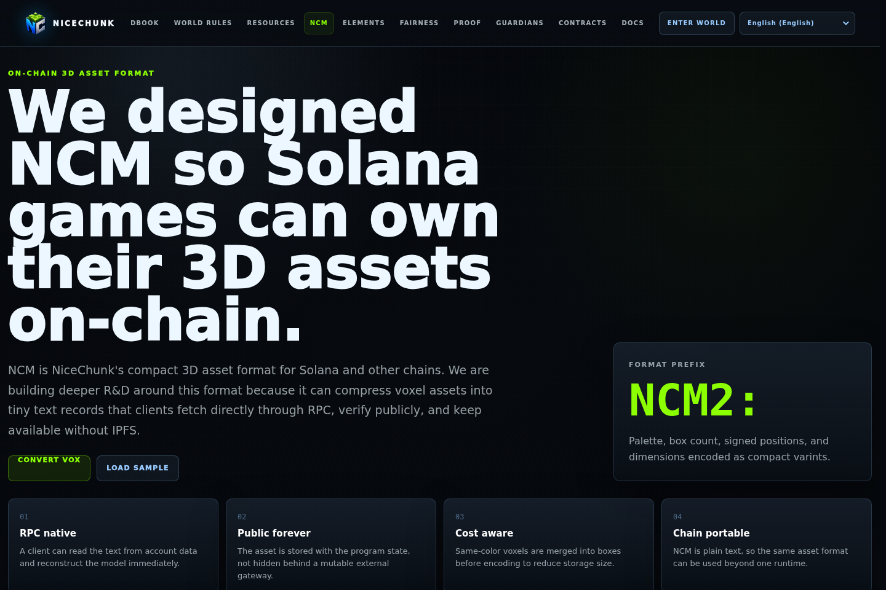
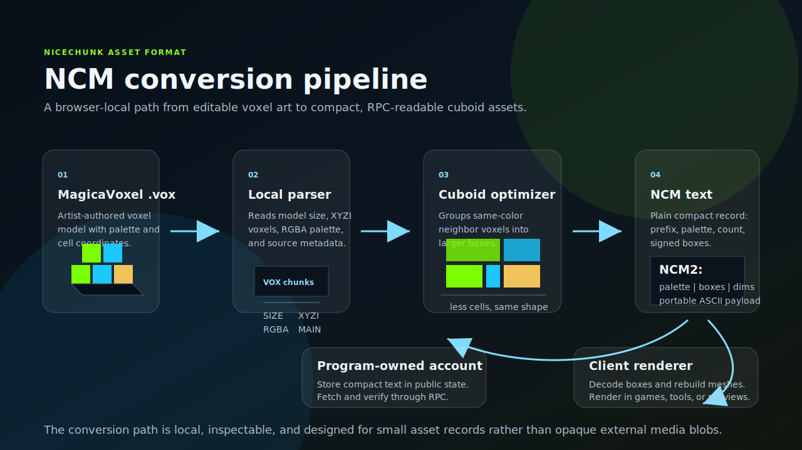
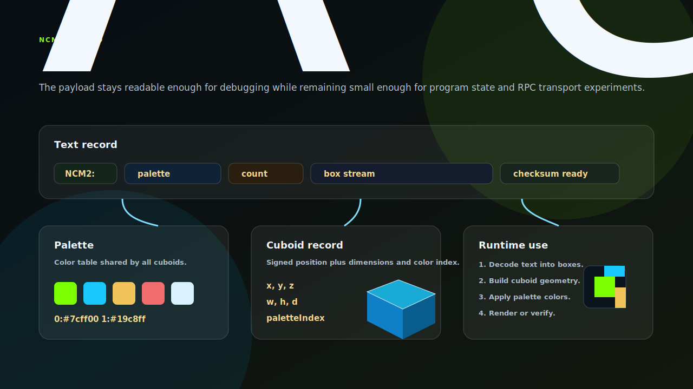

# NiceChunk NCM

NCM on-chain 3D asset format and local VOX converter.

## Project Overview

This repository contains the NCM asset format page and conversion tooling. NCM is a compact text representation for cuboid-based 3D assets that can be inspected, transported, and potentially stored in program-owned accounts.

The current tooling includes browser-side MagicaVoxel .vox parsing, conversion into NCM text, sample assets, and the shared voxel utility module.

The repository is split out because asset format design deserves independent iteration from gameplay pages and contract logic.

## Architecture Diagrams

### Conversion Pipeline

The conversion pipeline starts with a MagicaVoxel `.vox` file and keeps the entire process local to the browser or command-line tool. The parser reads the voxel grid, model dimensions, and palette. The optimizer then merges neighboring voxels with the same color into larger cuboids. That step is the reason NCM is practical: the runtime does not need to preserve every source voxel when the same shape can be represented by fewer boxes.

The final output is an `NCM2:` text record. The record can be stored, transported, decoded, and rendered without relying on an opaque binary package or external media gateway. In the long term, this is the path that makes small 3D assets viable for program-owned accounts or account-adjacent metadata.

### Data Layout

The NCM layout is intentionally simple. A record contains a format prefix, palette data, a cuboid count, and a stream of cuboid records. Each cuboid stores position, dimensions, and a palette index. That design keeps the model inspectable while still giving the renderer enough information to rebuild geometry efficiently.

This is not meant to compete with full cinematic 3D formats. NCM is designed for compact, deterministic, game-readable assets: equipment, collectibles, characters, props, and other objects where portability and verification matter more than arbitrary scene complexity.

## System Principles

- Compactness matters: the format is designed around cuboids and merged boxes so 3D assets can remain small.
- Local conversion first: the browser converter parses files locally and does not require an upload service.
- Readable representation: NCM should be easier to inspect than opaque binary blobs.
- Format logic should be reusable: conversion and decoding live in shared modules that other tools can import.

## How It Works

- Open the NCM page and load a sample or local .vox file.
- Convert the source model into NCM text and inspect the resulting cuboids.
- Use the command-line converter for repeatable file conversion during asset preparation.
- Keep generated .ncm examples small enough to remain practical for repository review.

## Why This Project Matters

NiceChunk needs an asset format that fits the project's on-chain and browser-first constraints. NCM is an experiment in making voxel-like assets compact, inspectable, and portable.

A dedicated NCM repository gives asset tooling a clear home and lets other projects experiment with the format without depending on the game client.

## Repository Layout

- `ncm/`
- `src/vox/`
- `scripts/vox-to-ncm.mjs`
- `public/media/vox/`

## Development Workflow

1. Clone the repository and inspect the focused source tree before changing shared contracts or generated artifacts.
2. Keep changes scoped to the domain of this repository. Cross-domain changes should be coordinated through the matching split repositories.
3. Run the smallest meaningful validation for the touched surface: build checks for programs, browser checks for pages, or fixture checks for deterministic libraries.
4. Update screenshots and documentation when behavior, visible UI, public constants, or developer-facing workflows change.

## Future Development Direction

- Define a formal NCM specification document and compatibility versioning.
- Add validation tests for encoder and decoder round trips.
- Support additional optimization passes for cuboid merging.
- Connect NCM assets to forging, marketplace, and future on-chain metadata flows.

## Maintenance Notes

This repository is a focused split from the main NiceChunk working tree. Keep the public surface explicit: avoid committing private keys, wallet files, deployment-only scripts, machine-specific configuration, or generated build artifacts. Runtime user-facing copy should stay behind the i18n layer where the project has an i18n surface.
